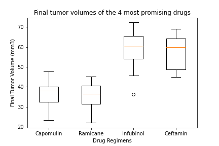
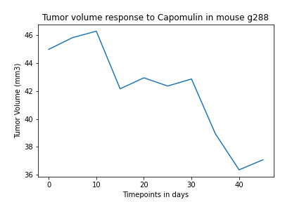
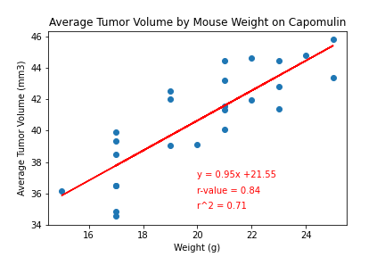

## Observations and Insights 

This project analyzes 2 datasets from a mice study screening for potential anti-cancer pharmaceuticals. The study treated 249 mice with 10 different drug regimens over the course of 45 days, and tumor development was measured at various timepoints. The drug of interest, Capomulin, is compared to the other regimens, and found to be the most promising. 

### Data analysis

An analysis of the data identified a mouse with duplicated time points and any data associated with that mouse was removed. The mean, median, variance, standard deviation, and SEM of tumor volume for the 10 drug regimens are summarized in a table. The 4 most promising drugs are further analyzed. 

The bar graph shows the number of data points per drug regimen. All drug treatments have around 150 data point or more, with Capomulin and Ramicane regimens containing the most data points. The mice genders are near evenly split between male and female. 

### Final tumor volumes of four regimens

The four most promising drug regimens, Capomulin, Ramicane, Infubinol, and Ceftamin, are further analyzed. Boxplots for each show mice treated with Capomulin and Ramicane have smaller final tumor volumes compared to mice treated with Infubinol and Ceftamin. Additionally the IQR for Capomulin and Ramicane are smaller, indicating a more tight distribution in the data points. Of the 4 drugs, only Infubinal has an outlier value. 

### Capomulin

Two mice treated with Capomulin, l509 and g288, were plotted on a line graph and show how tumor volume changes over time. Tumor volume in both mice show signs of responding to the drug treatment by 10 - 20 days, and nearing lowest tumor volume size in 35 - 40 days. 

There is a positive relationship between average tumor volume and mouse weight as seen in the scatter plot. The correlation coefficient and linear regression model indicate a strong correlation between mouse weight and average tumor volume for mice treated with Capomulin. It would be interesting for future studies to normalize the mouse weight to further investigate the affect of Capomulin on tumor volume reduction. 

